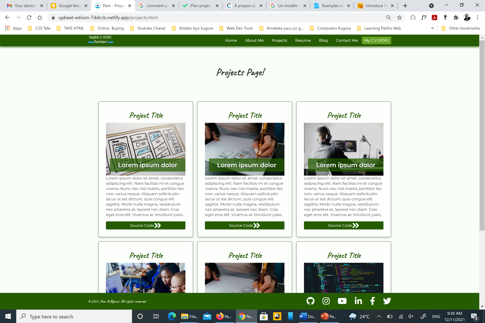

# PamphileNkurunzizaNgenzi_T1A2

# My Portfolio web / Coder Academy Term 1 Assignment 2

# Links

**GitHub Repository:** [Click here](https://github.com/ngupange/PamphileNkurunzizaNgenzi_T1A2)

**Live Website:** [Click here](https://upbeat-edison-7ddccb.netlify.app/index.html/)

# Purpose

The purpose of this portfolio is to put into practice what I learnt theoretically. This project is a study, just a test it is not final website about me it's a kind of prototype or blue print ... it will be updated often as I learn new skills. That means this portofolio will be real before our graduation to help recruiters know more about me. So far it's just a showcase and it reflects what I can achieve right now using just CSS and HTML only. Please allow me to stress on this that on the final website we will have real details about me not the placeholders. Stay tuned

# Sitemap

# Features & Functionality

The portofolio website is responsive you can access it on mobile, tablet, and desktop displays, and semantic elements are used to facilitate people with disabilty. It contains 6 pages all linked via menu bar you can access my CV as a PDF file from any page. Blog page has a search engine. 

# Screenshots of our web pages and wireframe

 1. Home page with a hero image and welcoming Text

# Wireframe view

 # Desktop view

 2. About me page with my brief biography (Still using Place holders)
 
 # Wireframe view

 
 # Desktop view
!
[Home Page desktop view](docs/AboutMe_Page_L.png)

 3. Projects page and this will be like a directory for projects I've worked on. Currently there is no projects so far that is why it's filled by placeholders text and stock images.

# Wireframe view

 
 
 # Desktop view

4. Resume I use this page as my CV in details (work history) (Still use placeholder text)

# Wireframe view

 
 # Desktop view

5. Blogs page has 2 sides one is blogs repository and other is search engine I used this as a blue print for my future blogs page. 

# Wireframe view

 
 # Desktop view

5. Contact me page  is for all who near or far want to reach out to us.

# Wireframe view

# Desktop view

6. My CV (PDF) button for those who want to print my CV this button is easy to access wherever you are on this website.  However the pdf file we have there is not mine it's from online stock.

## Target Audience
This site is aimed at two primary audiences. The first group is made up of those who are seeking developers for their business and this prototype can show them what I can do. The second, is individuals who are looking to contract a developer as a freelancer to work on a single project, such as a website.

## Tech Stack
The following tech was used in the production of this portfolio:
- HTML
- CSS
- Git/Github
- Netlify (Deployment)

## Other Resources
The following external resources were used in creating this website:
- Google Fonts
- Font awesome
- Unsplash (for stock images)